# NAME - EZEUKWU CHUKWUDUMEBI

## Getting Started

## STEP 1 
### Install the application on your android device 

## STEP 2 
### Click on the app icon to launch the app
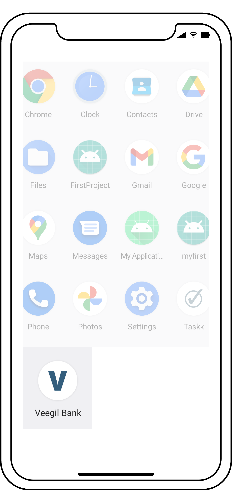

## STEP 3 ( Sign-up / Sign-in ) 
### On the onboard page, click on the arrow facing right, you will then be taken to the sign-up page, on the signup page fill required fields, phone number(exactly 10 characters) would be your account number, and your password, after successfully signing up, you will then be redirected to the login page, fill in same details you entered when signing up.

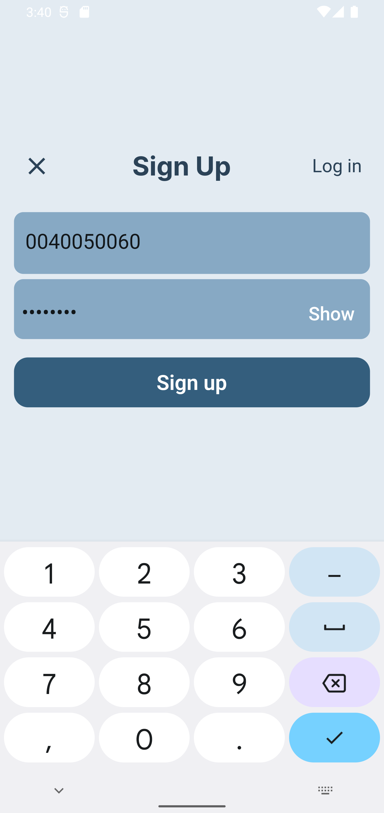
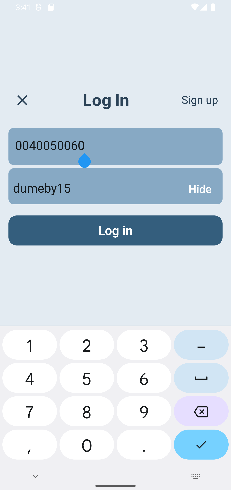

## STEP 4( HOMEPAGE )
### After signing in, the Homepage comes up next, this contains your account number, current balance, bank services, and path to transaction histories of your banking activities.
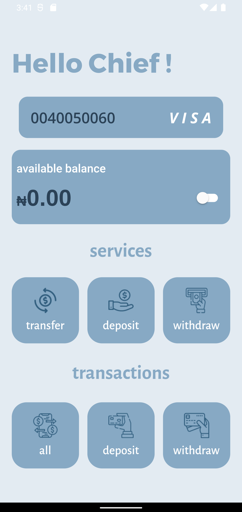

## STEP 5( TRANSFER )
### When you want to transfer money, click on the box which has a text (transfer) under the services section on the homepage, the transfer page comes up with two text fields and a button, fill in the phone number of the receiver and the amount you would like to send and click the button.
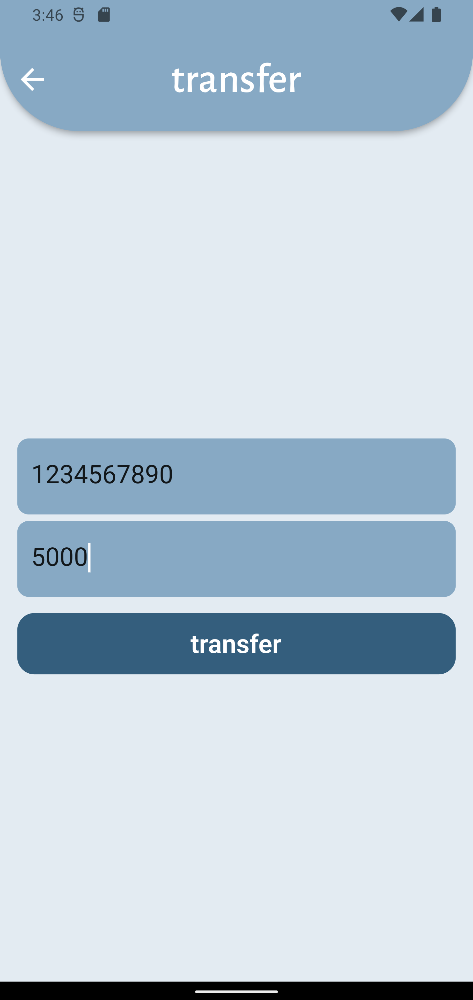
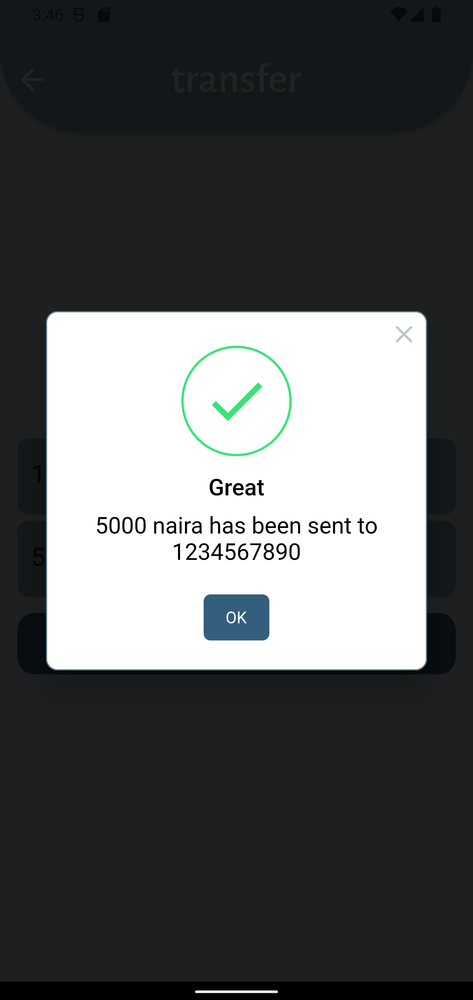

## STEP 6( DEPOSIT )
### When you want to deposit money into your account, click on the box which has a text (deposit) under the services section on the homepage, the deposit page comes up with your account number, a single text field, and a button, and enter the amount you would like to deposit and click the button. Check your balance, if the available balance didn't increase, pull down to reload.

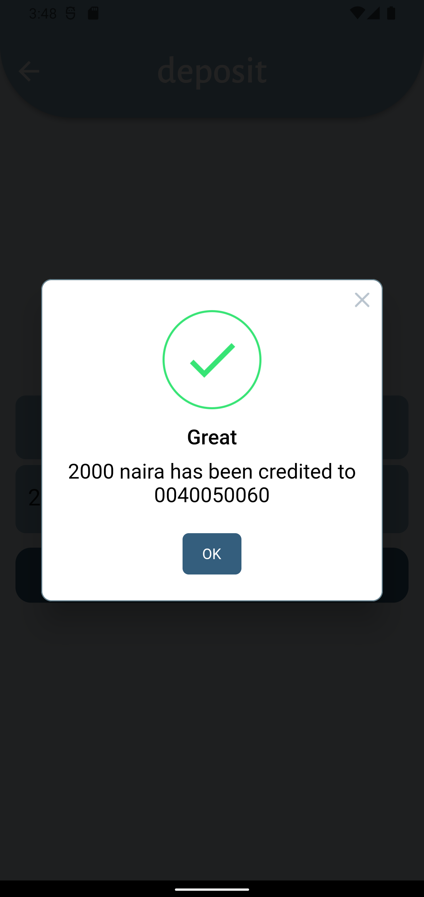
!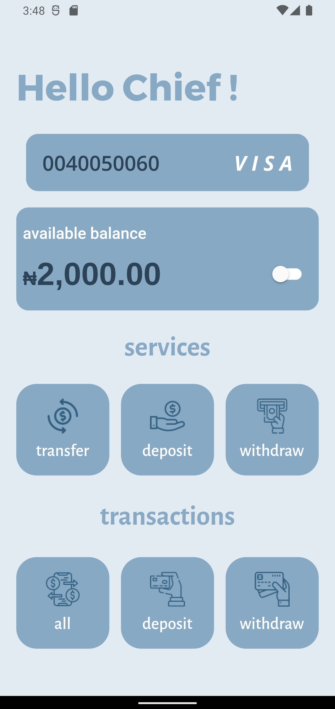

## STEP 7( WITHDRAW )
### When you want to withdraw money from your account, click on the box which has a text (withdraw) under the services section on the homepage, the withdraw page comes up with your account number, a single text field, and a button, enter the amount you would like to withdraw and click the button. Check your balance, if the available balance didn't decrease, pull down to reload.
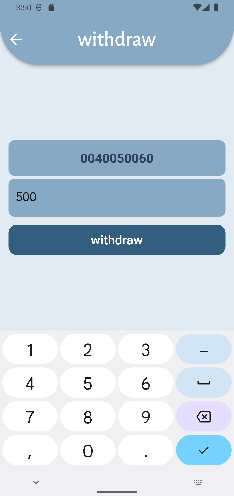
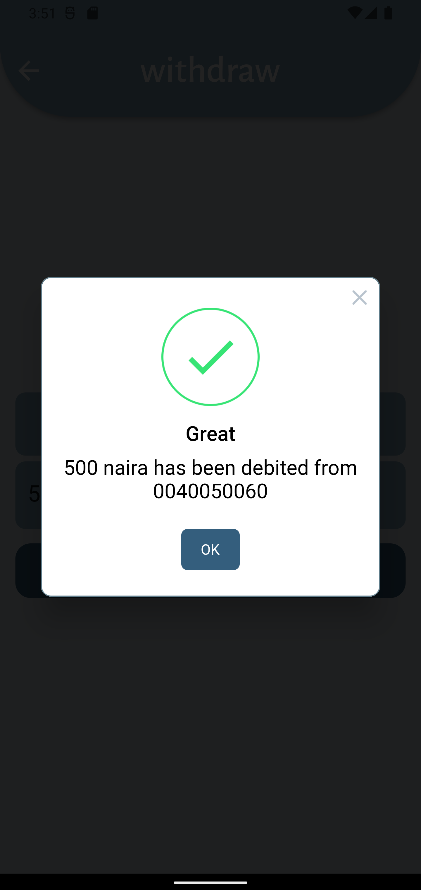
!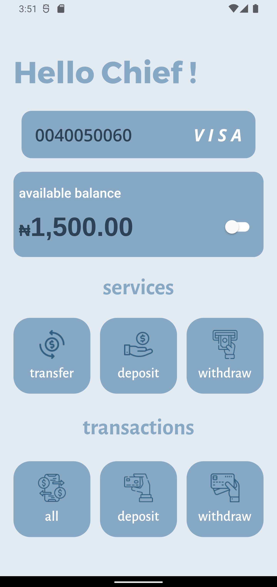

## STEP 8( All transactions history )
### To view all transaction history of your banking activities, click on the box which has a text (all) under the transaction section, a page comes up with all transactions that have been made(transfers, deposits, and withdrawals), a date to show when each transaction happened and the amount involved in each transaction.
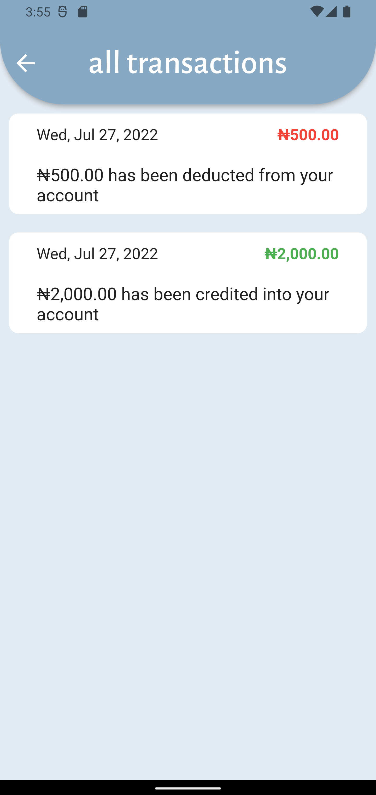 

## STEP 9( Deposit transactions history )
### To view the transaction history of all deposits made, click on the box which has a text (deposit) under the transaction section, a page comes up with all transactions that have been made(deposits), a date to show when each transaction happened and the amount involved in each transaction. 
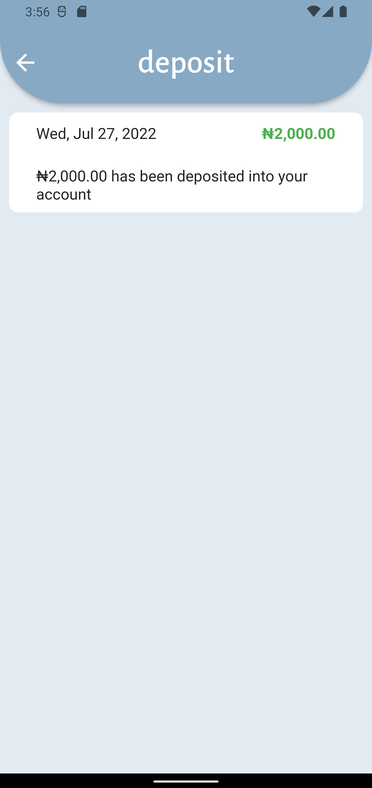

## STEP 10( Withdrawal transactions history )
### To view the transaction history of all withdrawals made, click on the box which has a text (withdraw) under the transaction section, a page comes up with all transactions that have been made(withdrawals), a date to show when each transaction happened and the amount involved in each transaction. 
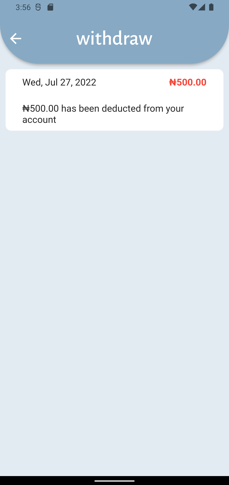

